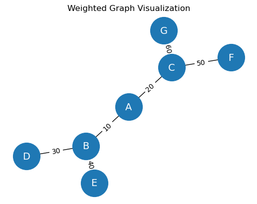

# 🧠 Graph Learning: An Introduction with NetworkX and NumPy

This project introduces the fundamentals of **graph learning** using Python. It walks through key graph concepts, graph types, visualizations, and real-world applications of graph-based machine learning using **NetworkX**, **NumPy**, and **Matplotlib**.

---

## 📚 Contents

- Introduction to Graph Learning
- Why Graphs Matter
- Real-world Applications
- Graph Learning Tasks
- Graph Neural Networks (GNNs)
- Classical vs. Deep Learning Approaches
- Graph Properties and Representations
- Practical Code Demonstrations with NetworkX
- Adjacency Matrix and Permutation Similarity

---

## 📌 Overview

Graphs are mathematical structures used to model relationships between entities. In recent years, they have become essential across fields like biology, physics, computer science, and social networks.

This notebook introduces:

- The basics of graphs: nodes, edges, degrees, neighbors
- Types of graphs: directed, weighted, connected
- Visualization using `networkx`
- Matrix representations of graphs
- Node classification and random walks
- Graph embeddings and their use in GNNs

---

## 🧩 Graph Learning Tasks

The notebook introduces and explains the following machine learning tasks on graphs:

- **Node Classification**  
- **Link Prediction**  
- **Graph Classification**  
- **Graph Generation**

These tasks are foundational for applications like recommendation systems, molecular property prediction, and community detection.

---

## 🤖 Why Graph Neural Networks?

Graph Neural Networks (GNNs) outperform traditional models by aggregating information not only from nodes, but also from **edges** and **graph structure**.  
GNNs can leverage:

- Node features (e.g. name, age)
- Edge features (e.g. relationship strength)
- Global graph statistics

GNNs use **graph convolution operations** that aggregate neighbor information across multiple layers, enabling powerful node representations for downstream tasks.

---

## 🔧 Code Demonstrations

The notebook includes several coding sections such as:

### ✔ Directed and Undirected Graphs

```python
G = nx.Graph()
DG = nx.DiGraph()
```

### ✔ Weighted Graphs

```python
WG.add_edges_from([('A', 'B', {"weight": 10}), ...])
```

### ✔ Connected vs. Disconnected Graphs

```python
nx.is_connected(G1)
```

### ✔ Adjacency Matrix

Let \( A \) be the adjacency matrix of graph \( G \), defined as:

\[
A_{ij} = 
\begin{cases}
1 & \text{if there is an edge between nodes } i \text{ and } j \\
0 & \text{otherwise}
\end{cases}
\]

```python
adj_matrix = nx.adjacency_matrix(G, nodelist=sorted(G.nodes())).todense()
```

---

## 🔄 Permutation Similarity in Graphs

Two graphs are **isomorphic** if one can be transformed into the other by reordering its nodes. This is expressed as:

\[
A' = P A P^\top
\]

Where:

- \( A \): original adjacency matrix  
- \( A' \): permuted adjacency matrix  
- \( P \): permutation matrix  
- \( P^\top \): transpose of \( P \)

The notebook includes a function to compute this:

```python
def permutation_matrix(from_order, to_order):
    ...
```

---

## 📉 Advantages and Disadvantages of Adjacency Matrix

### ✅ Advantages

- Constant-time lookup for edge existence
- Suitable for certain algorithms (e.g., shortest path)

### ❌ Disadvantages

- Memory usage grows quadratically with node count: \( \mathcal{O}(|V|^2) \)
- Inefficient for sparse graphs
- Harder to update dynamically

---

## 📦 Requirements

To run the notebook, make sure you have the following installed:

- Python 3.8+
- NetworkX
- NumPy
- Matplotlib

You can install them via:

```bash
pip install networkx numpy matplotlib
```

---

## 📊 Visualization Example

Directed and weighted graphs, connected components, adjacency matrices, and permutation transformations are all visualized using Matplotlib and NetworkX.




---

## 📁 License

This project is open-source and free to use for educational and non-commercial purposes.

---

## ✍️ Author

Mohammad Javad — 2025  
[GitHub Profile](https://github.com/mjmousavi97) | [LinkedIn](https://linkedin.com/in/mjmousavi97)
